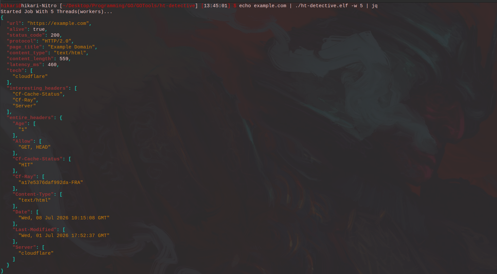

# HT-Detective

A lightweight concurrent HTTP reconnaissance tool written in Go.

HT-Detective sends HTTP requests to target hosts and extracts useful reconnaissance information including HTTP metadata, detected technologies, page titles, response headers, and other useful information in structured JSON format.

## Screenshot

<p align="center">
  
</p>

---

## Why?

HT-Detective was built to automate common HTTP reconnaissance tasks while serving as a practical Go learning project.

The project focuses on implementing worker pools, HTTP clients, HTML parsing, response analysis, technology fingerprinting, and structured JSON output without relying on external reconnaissance libraries.

---

## Structure

```
HT-Detective/
│
├── assets/
│   └── htdetective.png
│
├── detector.go
├── extractor.go
├── main.go
├── result.go
├── worker.go
│
├── go.mod
├── go.sum
├── README.md
├── LICENSE
└── .gitignore
```

---

## Features

- Concurrent worker pool
- HTTP and HTTPS support
- Automatic HTTPS prefixing
- Status code detection
- Response latency measurement
- HTTP protocol detection (HTTP/1.1, HTTP/2)
- HTML page title extraction
- Content-Type extraction
- Content-Length extraction
- Lightweight technology fingerprinting
- Interesting HTTP header detection
- Complete response header collection
- JSON output

---

## Technology Fingerprinting

HT-Detective performs lightweight technology fingerprinting using HTTP response headers and cookies.

Currently supported technologies include:

- nginx
- Apache
- LiteSpeed
- Caddy
- IIS
- RoadRunner
- Gunicorn
- Uvicorn
- Google Web Server (GWS)
- PHP
- Laravel
- Express
- Node.js
- Django
- Java
- ASP.NET
- Cloudflare
- Akamai
- Sucuri

---

## Requirements

- Go 1.24 or newer

---

## Installation

Clone the repository:

```bash
git clone https://github.com/abysseraphim/HT-Detective.git
cd HT-Detective
```

Build:

```bash
go build -o ht-detective
```

---

## Cross Compilation

### Linux (amd64)

```bash
GOOS=linux GOARCH=amd64 go build -o ht-detective
```

### Windows (amd64)

```bash
GOOS=windows GOARCH=amd64 go build -o ht-detective.exe
```

### macOS (Apple Silicon)

```bash
GOOS=darwin GOARCH=arm64 go build -o ht-detective
```

---

## Usage

Single target

```bash
echo google.com | ./ht-detective
```

Multiple targets

```bash
cat urls.txt | ./ht-detective
```

Specify worker count

```bash
cat urls.txt | ./ht-detective -w 50
```

---

## Sample Output

```json
{
  "url": "https://soft98.ir",
  "alive": true,
  "status_code": 403,
  "protocol": "HTTP/2.0",
  "page_title": "403 Forbidden",
  "content_type": "text/html",
  "content_length": 1242,
  "latency_ms": 420,
  "tech": [
    "litespeed"
  ],
  "interesting_headers": [
    "Strict-Transport-Security",
    "Content-Security-Policy",
    "Cache-Control",
    "Server"
  ],
  "entire_headers": {
    "Cache-Control": [
      "private, no-cache, no-store, must-revalidate, max-age=0"
    ],
    "Content-Security-Policy": [
      "frame-ancestors 'none';"
    ],
    "Server": [
      "LiteSpeed"
    ],
    ...
  }
}
```

---

## Future Improvements

- Additional technology fingerprints
- Custom request headers
- Output filtering
- Additional output formats
- HTTP method selection

---

## License

This project is licensed under the MIT License.
